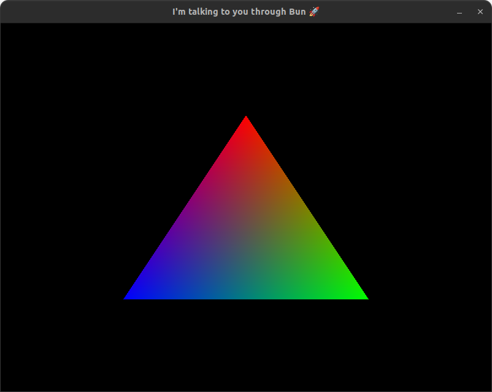

# bun-sdl2-binding

This is an attempt to create a SDL2 binding for Bun, and it's my first time using FFI, so please, don't judge me!



See this example in [index.ts](index.ts)

---

# Requirements

1. Install [Bun](https://bun.sh/)
2. Install the SDL2 development library
```shell
sudo apt install libsdl2-dev
```

# Setup

To install dependencies:

```bash
git clone git@github.com:Pacheco95/bun-sdl2-binding.git
cd bun-sdl2-binding
bun install
```

To run the example above:

```bash
bun run index.ts
```

To run tests

```bash
bun test --coverage
```

This project was created using `bun init` in bun v1.0.7. [Bun](https://bun.sh) is a fast all-in-one JavaScript runtime.
